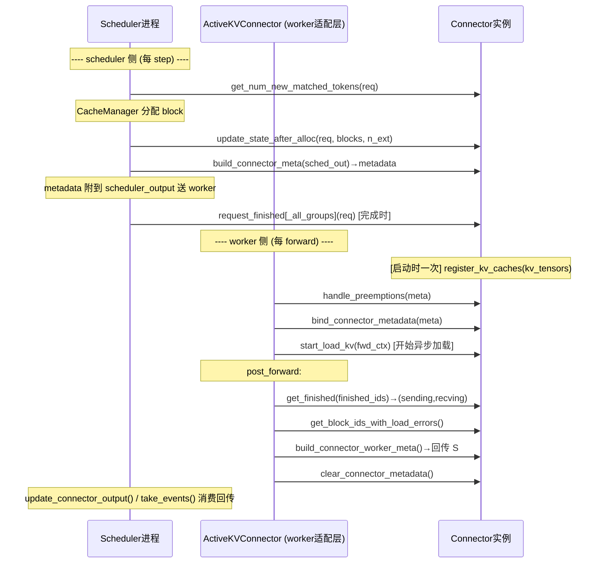
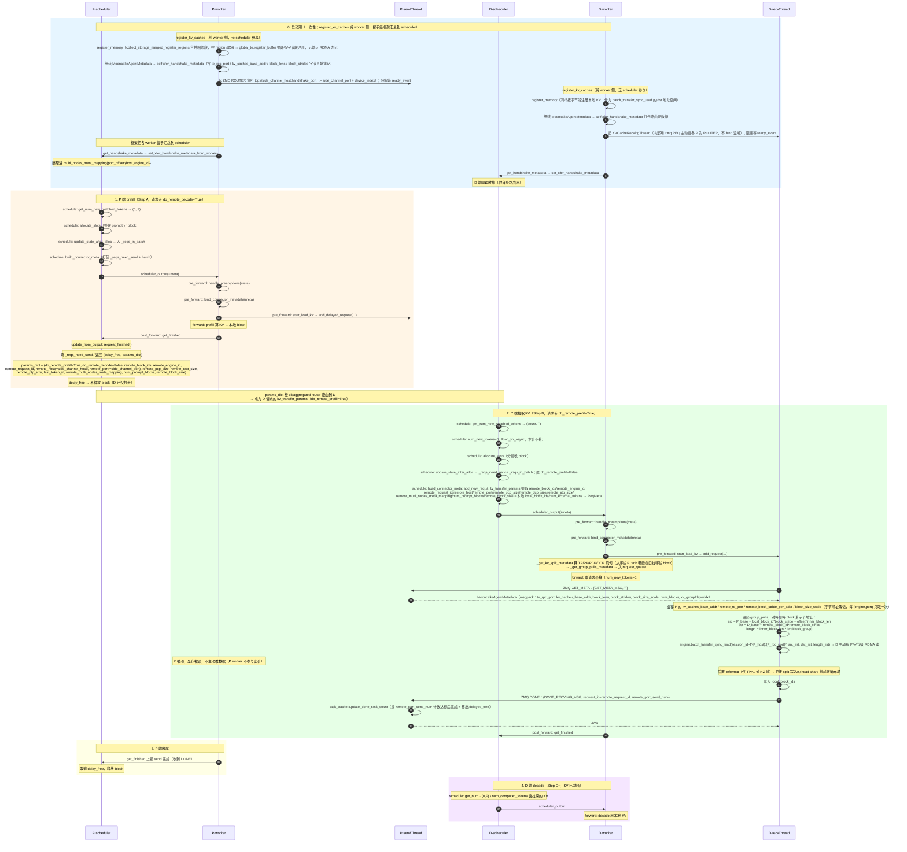
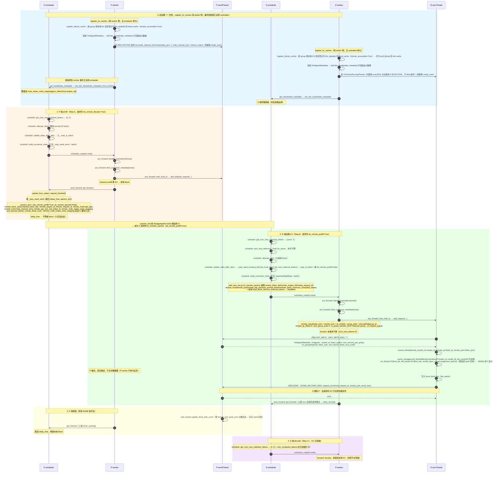

# HIXL Connector 背景与设计

> 三部分：① vLLM 的 KV Cache 传输框架（`KVConnectorBase_V1`）；② `MooncakeConnectorV1` 的实现（数据面 + 控制面）；③ HIXL 直连适配方案（待补充）。
> 生成日期：2026-07-17
> 代码引用统一用 `文件:行号`（相对各自仓库根），便于跨仓库跳转。

---

# 第一部分：vLLM 的 KV Cache 传输机制（`KVConnectorBase_V1`）

## 1.1 它是什么

[`KVConnectorBase_V1`](../../../../vllm/vllm/distributed/kv_transfer/kv_connector/v1/base.py)（709 行）是 vLLM v1 KV connector 体系的**抽象基类**，定义"KV cache 在外部（远端节点 / 异构存储）与 vLLM 本地 paged KV buffer 之间搬运"的协议。所有 connector（mooncake / nixl / lmcache / 未来的 HIXL）都是它的子类。它解决的核心问题：**P/D 分离时，把 P 算好的 KV 搬到 D，让 D 不用重算**。

## 1.2 核心设计：一个类，两个角色

最关键的设计是 **同一个类在两个进程里以不同 role 实例化**（base.py:124-129）：

```python
class KVConnectorRole(enum.Enum):
    SCHEDULER = 0   # scheduler 进程：决策（传什么、何时传）
    WORKER = 1      # worker 进程：执行（真正搬 KV）
```

- scheduler 进程：工厂用 `role=SCHEDULER` 建实例 → 只调 scheduler-side 方法；
- worker 进程：`ensure_kv_transfer_initialized` 用 `role=WORKER` 建实例（存入全局 `_KV_CONNECTOR_AGENT`）→ 只调 worker-side 方法。
- 子类通常在 `__init__` 按 role 分支（建 scheduler 或 worker 子对象，方法各自转发）。构造函数签名固定 `(vllm_config, role, kv_cache_config)`（base.py:184-201）。

## 1.3 三个 Metadata 类（数据流转的载体）

connector 的数据流本质是 **scheduler↔worker 之间传元数据**（真正的 KV 在 worker 侧搬）：

| 类 | 方向 | 用途 | 关键点 |
|---|---|---|---|
| `KVConnectorMetadata` | scheduler → worker | 本 step 的传输计划 | 空标记类；子类用 dataclass，须可 pickle（跨进程） |
| `KVConnectorWorkerMetadata` | worker → scheduler | worker 回传状态 | 有 `aggregate(other)`：多 worker meta 合并后交 scheduler |
| `KVConnectorHandshakeMetadata` | P-worker ↔ D-worker | 带外握手（互告地址） | 须可序列化 |

## 1.4 SupportsHMA（混合内存分配器支持）

独立 ABC（base.py:85-121）。继承它 = 支持 **Hybrid Memory Allocator**（vLLM 给"多种 KV spec 类型 group 分别分配 cache"的管理器，如 FullAttention+Mamba 混合模型）。继承后须实现 `request_finished_all_groups`（base.py:92）；不继承则只能单 group FullAttention。

## 1.5 方法全景（按"必须实现 vs 可选"分组）

### 🔴 抽象方法（必须实现，7 个）

| 侧 | 方法 | 行号 | 作用 |
|---|---|---|---|
| scheduler | `get_num_new_matched_tokens` | :453 | 返回 `(int\|None, bool)`：外部可加载的 token 数；None=稍后再问；bool=是否异步 |
| scheduler | `update_state_after_alloc` | :488 | block 分配后记录待加载请求；基于 `num_external_tokens` 判断是否加载 |
| scheduler | `build_connector_meta` | :514 | 生成本 step 的 `KVConnectorMetadata`；不改 scheduler_output |
| worker | `start_load_kv` | :292 | forward 前开始异步加载 KV 到 paged buffer（与计算重叠） |
| worker | `wait_for_layer_load` | :310 | 阻塞等到某层加载完（attention 层内） |
| worker | `save_kv_layer` | :324 | 开始异步保存某层 KV（attention 层内） |
| worker | `wait_for_save` | :346 | forward 退出前等所有 save 完成（防 buffer 被覆盖） |

> 三个 layer-wise 方法在整-request 传输模式的 connector 中常被实现为 no-op，仅 layerwise connector 才真正实现。

### 🟢 可选方法（有默认实现，按需覆写）

- **worker**：`register_kv_caches`(:251)、`get_finished`(:357)、`get_block_ids_with_load_errors`(:375)、`handle_preemptions`(:285)、`bind_connector_metadata`(:211)/`clear_connector_metadata`(:223)/`get_finished_count`(:630) 等。
- **scheduler**：`request_finished`(:547，默认 `(False,None)`)、`bind_gpu_block_pool`(:443)、`set_xfer_handshake_metadata[_pp_aware]`(:653/:664)、`reset_cache`(:696) 等。

## 1.6 生命周期：vLLM 怎么驱动这些方法

一个 engine step 里，vLLM 这样调用 connector（worker 侧经由 [`ActiveKVConnector`](../../../../vllm/vllm/v1/worker/gpu/kv_connector.py) 适配层）：



**要点**：
- **调用时序是 vLLM 框架（base + ActiveKVConnector）驱动的，通用**——mooncake / hixl / lmcache 全遵循，connector 只被动响应。
- scheduler 侧纯决策（不碰网络），产出 metadata；worker 侧执行（`start_load_kv` 触发传输，`get_finished` 报告完成）；metadata 是两者的桥梁。
- 图里的 🔴 抽象方法由子类（mooncake/hixl）填业务；🟢 可选方法 base 有默认，子类按需覆写。**传输业务差异（如 mooncake 的字节读 vs HIXL 的 block 读）藏在 `start_load_kv` 等方法内部，时序图里看不出来。**

### 1.6.1 时序图的代码落地（调用点）

时序图里每个箭头，代码里就两个文件调用：**scheduler 侧全在 `vllm/v1/core/sched/scheduler.py`，worker 侧全在 [`ActiveKVConnector`](../../../../vllm/vllm/v1/worker/gpu/kv_connector.py)（`vllm/v1/worker/gpu/kv_connector.py`）**。

**调用链总览**：

```
vLLM engine 一个 step
├─ scheduler 进程：scheduler.schedule()          ← 决策（时序图的 S→C）
│   产出 SchedulerOutput（夹带 kv_connector_metadata）
└─ worker 进程：GPUModelRunner.execute_model()    ← 执行（时序图的 AW→C）
    ├─ ActiveKVConnector.pre_forward()
    ├─ … forward 计算 …
    └─ ActiveKVConnector.post_forward()
```

**Scheduler 侧 — `scheduler.py`**：

```python
# 1. 算完本地 computed blocks 后，问 connector 有多少外部 token 可加载
ext_tokens, load_kv_async = \
    self.connector.get_num_new_matched_tokens(request, num_new_local_computed_tokens)  # scheduler.py:763

# 2. block 分配后，告诉 connector 分配结果（它据此决定要不要加载）
self.connector.update_state_after_alloc(
    request, self.kv_cache_manager.get_blocks(request_id), num_external_computed_tokens)  # scheduler.py:956

# 3. 构造 scheduler_output 时，生成 connector 的传输计划
def _build_kv_connector_meta(self, connector, scheduler_output):
    return connector.build_connector_meta(scheduler_output)   # scheduler.py:1189

# 4. 请求完成时，决定 block 立即释放还是延迟（P 侧 prefill 完）
if not isinstance(self.connector, SupportsHMA):
    return self.connector.request_finished(request, block_ids[0])         # scheduler.py:2501
return self.connector.request_finished_all_groups(request, block_ids)     # scheduler.py:2503
```

**Worker 侧 — `ActiveKVConnector`**（适配层，把 model_runner 的 pre/post_forward 翻译成 connector 方法调用；`self.kv_connector` 是 `get_kv_transfer_group()` 返回的全局 connector 实例）：

```python
# __init__（启动时一次）→ register_kv_caches（kv_connector.py:56）
self.kv_connector.register_kv_caches(kv_caches_dict)

# pre_forward（每 forward 开始）：绑计划、派活，不阻塞
def pre_forward(self, scheduler_output):
    # scheduler 在 scheduler.py:1166 挂的本 step 收发计划（即"桥梁"）
    kv_connector_metadata = scheduler_output.kv_connector_metadata
    # 抢占/驱逐前清理 paged buffer——base 默认 no-op（base.py:285），HIXL 未覆写
    self.kv_connector.handle_preemptions(kv_connector_metadata)       # :67
    # 把计划存到 self._connector_metadata（base.py:211），供 start_load_kv 内部取
    self.kv_connector.bind_connector_metadata(kv_connector_metadata)  # :68
    # 真正派活（HIXL 重写，hixl_connector.py:1309）：
    #   1. 遍历 metadata.reqs_in_batch，给 send/recv 线程 task_tracker 登记本批 req
    #   2. 遍历 metadata.requests（D 待接收），每组构造 GroupPull（Phase 1
    #      num_group_pulls=1、remote_tp_offset=0），算远端握手端口
    #      remote_port + tp_rank，调 kv_recv_thread.add_request(...) 交接收线程异步 pull_blocks
    #   3. 遍历 metadata.requests_to_send（P 延迟发送），调 kv_send_thread.add_delayed_request(...)
    # 只"派活"给后台线程，真正的 pull_blocks/发送在收发线程里异步进行，与 model forward 并行
    self.kv_connector.start_load_kv(get_forward_context())            # :72

# post_forward（每 forward 结束）：收结果、清状态
def post_forward(self, finished_req_ids, wait_for_save=True):
    if wait_for_save:
        # 阻塞至异步 save 完成防 paged buffer 被覆盖；HIXL 是 no-op（hixl_connector.py:829）——
        # P 发送由 KVCacheSendingThread 独立持有/拷贝，不在 forward 关键路径覆盖 buffer。
        # save_kv_layer / wait_for_layer_load 同样 no-op
        self.kv_connector.wait_for_save()                             # :85
    # 从收发线程取本 step 已完成的 req id（hixl_connector.py:1291）：
    #   P 端 kv_send_thread.get_and_clear_finished_requests() → finished_sending
    #   D 端 kv_recv_thread.get_and_clear_finished_requests() → finished_recving
    # scheduler 据此判定哪些 req 的 KV 转移真正结束（对应 request_finished 返回
    # delay_free_blocks=True 的那些），可释放延迟占用的 block
    output.finished_sending, output.finished_recving = \
        self.kv_connector.get_finished(finished_req_ids)              # :87
    # 取加载失败的 block id（hixl_connector.py:1304）：D 端 kv_recv_thread 拉取失败时
    # 标记 invalid 并清空（get_and_clear_invalid_block_ids），告诉调度器这些 block 的
    # KV 不可信、需重算
    output.invalid_block_ids = \
        self.kv_connector.get_block_ids_with_load_errors()            # :89
    # 构造回传 scheduler 的 worker 元数据（如远端握手端口）；HIXL 基类默认 None（base.py:429），
    # 握手走 set_xfer_handshake_metadata_*，Phase 1 此处一般空
    output.kv_connector_worker_meta = \
        self.kv_connector.build_connector_worker_meta()               # :93
    # 把 self._connector_metadata 置 None（base.py:223），防本 step 计划泄漏到下一步
    self.kv_connector.clear_connector_metadata()                      # :95
```

> 代码位置：HIXL worker 侧实现在 [`hixl_connector.py`](../../../vllm_ascend/distributed/kv_transfer/kv_p2p/hixl_connector.py)，收发线程 `KVCacheSendingThread` / `KVCacheRecvingThread` 同文件。

**时序 ↔ 代码对照表**：

| §1.6 箭头 | 调用点 | 文件:行 |
|---|---|---|
| `get_num_new_matched_tokens` | `scheduler.schedule` | scheduler.py:763 |
| `update_state_after_alloc` | `scheduler.schedule` | scheduler.py:956 |
| `build_connector_meta` | `_build_kv_connector_meta` | scheduler.py:1189 |
| `request_finished[_all_groups]` | 请求完成处理 | scheduler.py:2501/2503 |
| `register_kv_caches`（启动一次） | `ActiveKVConnector.__init__` | kv_connector.py:56 |
| `handle_preemptions` | `pre_forward` | kv_connector.py:67 |
| `bind_connector_metadata` | `pre_forward` | kv_connector.py:68 |
| `start_load_kv` | `pre_forward` | kv_connector.py:72 |
| `wait_for_save` | `post_forward` | kv_connector.py:85 |
| `get_finished` | `post_forward` | kv_connector.py:87 |
| `get_block_ids_with_load_errors` | `post_forward` | kv_connector.py:89 |
| `build_connector_worker_meta` | `post_forward` | kv_connector.py:93 |
| `clear_connector_metadata` | `post_forward` | kv_connector.py:95 |

**两个关键观察**：

1. **scheduler 和 worker 是两个进程**，靠 `SchedulerOutput.kv_connector_metadata` 传话：scheduler 在 `build_connector_meta` 把传输计划塞进去 → 序列化送 worker → worker 在 `pre_forward` 里 `bind_connector_metadata` 取出。这就是 §1.3 说的"metadata 是 scheduler↔worker 的桥梁"。
2. **真正触发 KV 传输的是 `start_load_kv`**（kv_connector.py:72）。mooncake 在这里把请求入 `KVCacheRecvingThread` 队列（异步拉），HIXL 也在这里入队（→ `pull_blocks`）。所以时序图里 `start_load_kv` 是个**黑盒**——传输业务全在这个钩子内部，字节读还是 block 读时序图体现不出。

**整 step 控制流串联**（调度侧 ↔ worker 侧）：

```
update_state_after_alloc（登记单个 req 的待接收 block）
        → build_connector_meta（把本 batch 所有登记汇总成 metadata）
        → [跨进程] scheduler_output.kv_connector_metadata
        → pre_forward: bind + start_load_kv（派发给收发线程异步执行）
        → forward 计算（与 pull/push 并行）
        → post_forward: get_finished + get_block_ids_with_load_errors（汇报完成/失败）
        → clear_connector_metadata
```

> 上文逐行描述对 mooncake 同样适用（钩子时序是框架驱动的通用合同），差异只在 `start_load_kv` 内部——mooncake 入队后走 `batch_transfer_sync_read` 字节级 RDMA 读，HIXL 入队后走 `pull_blocks` 块索引读（见 §2.1.3 / §3 的 HIXL 数据面）。`wait_for_save` 在 mooncake 里也是 no-op（整 request 传输，非逐层）。

---

## 1.7 关键契约（易踩坑点）

1. `get_num_new_matched_tokens` 必须无副作用，可能多次调用（:479）。
2. `update_state_after_alloc` 可能被调两次（异步加载），判断加载看 `num_external_tokens` 不是 `blocks` 是否空（:495-504）。
3. `request_finished` 返回 `True` = connector 接管 block 异步释放，直到 `get_finished` 返回该 req_id 才真释放（:547-566）。
4. `get_finished` 返回的 id 必须来自某次调用传入的 `finished_req_ids` 集合（:370-371）。
5. 失败 block 最迟在 `get_finished` 报告该 req 的那步上报 `get_block_ids_with_load_errors`（:383-391）。
6. 逐层异步的 connector 须 `requires_piecewise_for_cudagraph=True`（:608-628）。

---

# 第二部分：MooncakeConnectorV1 的实现

本部分基于 [`mooncake_connector.py`](../../../vllm_ascend/distributed/kv_transfer/kv_p2p/mooncake_connector.py)（3552 行）的完整阅读。MooncakeConnectorV1 是 vllm-ascend 三种 P2P connector 中能力最全的，也是 HIXL 适配的对标对象。

## 2.1 时序图与方法实现（对照第一部分 §1.6）

第一部分 §1.6 的时序是 vLLM 框架驱动的"调度合同"。本节逐方法说明 **MooncakeConnectorV1 在这些钩子里具体填了什么业务**，并标出代码位置。

### 2.1.1 Scheduler 侧（决策，不碰网络）

`MooncakeConnectorScheduler`（mooncake_connector.py:1529）。

| 框架钩子 | mooncake 的实现 | 代码 |
|---|---|---|
| `get_num_new_matched_tokens` | **D 侧**：若 `do_remote_prefill`，返回"整个 prompt 的 token 数 − 已算的"（要从 P 全拉）；**P 侧**：对 Mamba 模型截断末 token（`_truncate_request_for_prefill`） | :1685 |
| `update_state_after_alloc` | 校验 `remote_block_ids`/`remote_engine_id`/`remote_host`/`remote_port` 齐全后，把 `(request, local_block_ids, num_external_tokens)` 存进 `_reqs_need_recv`；末尾把 `do_remote_prefill` 置 False（**一个请求只触发一次传输**） | :1723 |
| `build_connector_meta` | 把 `_reqs_need_recv` 转成 `ReqMeta` 列表塞进 `MooncakeConnectorMetadata`，清空待发队列 | :1746 |
| `request_finished`（**P 侧**） | prefill 完成时：算出 prompt 占的 block、裁剪（MTP/SWA），若需要发 KV 则 `delay_free=True` + 把 **P 自己的地址信息**（`remote_host`/`remote_port`/`remote_engine_id`/`num_prompt_blocks`/`remote_block_size` 等）塞进 `kv_transfer_params`，经 vLLM 握手送到 D | :1774 |

> 关键：**P 的地址信息是经 `request_finished` → `kv_transfer_params` → vLLM 握手机制送到 D 的**，不是经 connector 自己的网络。D 拿到后才知道去哪拉。

### 2.1.2 Worker 侧（执行，碰网络）

`MooncakeConnectorWorker`（mooncake_connector.py:1866）+ `KVCacheRecvingThread`（D，:408）+ `KVCacheSendingThread`（P，:244）。

| 框架钩子 | mooncake 的实现 | 代码 |
|---|---|---|
| `register_kv_caches` | **数据面准备**：`_build_kv_group2layeridx` 建 group→层映射；算每层 KV 的字节地址簿记（`kv_caches_base_addr`/`block_len_per_addr`/`block_stride_per_addr`/`block_size_scale`）；`collect_storage_merged_register_regions` 合并相邻存储 → `global_te.register_buffer`（循环 `register_memory(ptr,size)`，按字节段注册）；组装 `MooncakeAgentMetadata`；**P 侧起 `KVCacheSendingThread`（ZMQ ROUTER），D 侧起 `KVCacheRecvingThread`** | :2224 |
| `start_load_kv` | **D 侧**：对每个待拉请求，`_get_kv_split_metadata` 算出"从哪些 P rank 的哪些端口拉哪些 block"（含 TP/PP/PCP/DCP 几何）→ `_get_group_pulls_metadata` 生成 group 拉取描述 → `kv_recv_thread.add_request` 入队。**真正的字节级传输在 RecvingThread 后台线程异步做**（`start_load_kv` 只入队即返回，与计算重叠） | :3187 |
| `get_finished` | 查 `kv_send_thread`/`kv_recv_thread` 的 `task_tracker.get_and_clear_finished_requests()`，返回 `(done_sending, done_recving)` | :2363 |
| `get_block_ids_with_load_errors` | D 侧 RecvingThread 拉取失败时 `_mark_failed_recv_request` 记录的 `invalid_block_ids`，上报给 scheduler 触发重算 | :2385 |
| `wait_for_layer_load` / `save_kv_layer` / `wait_for_save` | **no-op**（整 request 传输模式，非逐层） | dispatcher:1483-1495 |

### 2.1.3 RecvingThread 内部的传输执行（D 侧，重点）

D 侧 `KVCacheRecvingThread` 的 `_transfer_kv_cache_all_groups`（:731）是**真正搬 KV 的地方**，时序图里藏在 `start_load_kv` 的黑盒内：

```
_transfer_kv_cache_all_groups(req_meta):
  1. 首次拉某 P 时 _get_remote_metadata：
       ZMQ 发 GET_META_MSG → 收 MooncakeAgentMetadata
       → 缓存 P 的 kv_caches_base_addr / te_rpc_port / block_strides（字节寻址簿记）
  2. 遍历 group_pulls，对每层每 block 算字节地址：
       src = P_base_addr + local_block_id*block_stride + inner_offset*inner_block_len
       dst = D_base_addr + remote_block_id*remote_block_stride
       length = inner_block_len * len(block_group)
  3. engine.batch_transfer_sync_read(session_id, src_list, dst_list, length_list)
       ↑ 唯一真正传 KV 的调用，D 主动从 P 字节级 RDMA 读
  4. 后置 reformat（仅 TP>1 或 NZ 时）：把按 split 写入的 head shard 拼成正确布局
  5. ZMQ 发 DONE_RECVING_MSG 通知 P（P 据此释放 block）
```

### 2.1.4 mooncake 数据面 4 API 详解（+ HIXL 对应）

vllm-ascend 直接调 Mooncake engine 的就这 4 个方法。**HIXL 适配的本质就是替换这 4 个**（第三部分 §3.2 的方法体差异都围绕它们）。

**总览（含 HIXL 对应）**：

| # | mooncake API | 作用 | 调用时机（mooncake_connector.py） | HIXL 对应 |
|---|---|---|---|---|
| 1 | `engine.initialize(host, "P2PHANDSHAKE", "ascend", dev)` | 初始化引擎（P2P 握手，ascend 后端） | worker `__init__`（:1931） | `LLMDataDist(role, cluster_id)` + `init(options)` |
| 2 | `engine.register_memory(ptr, size)` | 注册 KV 内存段（远端可 RDMA 访问） | `register_kv_caches`（:2286） | `register_blocks_cache(CacheDesc, addrs, ...)` |
| 3 | `engine.get_rpc_port()` | 取传输端口（D 建 session 用） | worker `__init__`（:1935） | `listen_ip_info`（`LLMConfig` 设，无需单独取） |
| 4 | `engine.batch_transfer_sync_read(session, src, dst, len)` | D 从 P 批量同步读 KV（字节寻址） | `_transfer`（:896） | `pull_blocks(BlocksCacheKey, dst_cache, src/dst_blocks)` |

**逐个说明**：

**① `initialize(hostname, handshake_type, transport, device_name)`** — 初始化 TransferEngine，P2P 握手发现（非 etcd/master），ascend 后端。经 `GlobalTE.get_transfer_engine`（双重检查锁单例）调用。返回 int，`!=0` 抛 RuntimeError。`device_name` 仅 PP>1 时传。

**② `register_memory(ptr, size)`** — 把本地 KV 内存段注册给引擎，使远端能 RDMA 访问（P "被动暴露"的基础）。**按字节段注册**（ptr+size，非 block/tensor）。`register_kv_caches` 经 `collect_storage_merged_register_regions`（合并相邻存储，控 region ≤256）+ `validate_register_region_count` 后循环调。返回 int，`!=0` 抛 RuntimeError；幂等。

**③ `get_rpc_port()`** — 取传输 RPC 端口。D 用 `(P_host, P_rpc_port)` 组 `session_id` 才能读。存进 `MooncakeAgentMetadata.te_rpc_port`（:2304）经 ZMQ 握手传 D，D 存 `remote_te_port`（:757）。直接返回端口（无返回码）。

**④ `batch_transfer_sync_read(session_id, src_list, dst_list, length_list)`** — **整个 connector 唯一真正传 KV 的调用，D-pull 核心**。`session_id = f"{host}:{port}"`；src/dst/length 是 P/D 字节地址 / 段长。vllm-ascend 自己做 block→字节映射（`src = base + block_id*stride + offset*inner_len`，:867-869），mooncake 只按这些地址批量搬。返回 int，`<0` 抛 RuntimeError。

**调用顺序（worker 生命周期）**：

```
worker __init__（启动一次）:    ① initialize  →  ③ get_rpc_port
register_kv_caches（启动一次）: ② register_memory（循环，按字节段）
_transfer（每请求，D 端）:      ④ batch_transfer_sync_read（字节寻址）
```

**关键观察**：

1. 只有 ④ 真正传 KV；①②③ 是准备（建引擎 / 注册内存 / 暴露端口）。
2. **全是字节寻址**——mooncake 不知道"block/层/TP"，全靠 vllm-ascend 自己算裸地址。这正是 HIXL 要换掉的（block 索引寻址，HIXL 按 `CacheDesc.shape` 自己算）。
3. 错误处理统一返回码：①② 用 `!=0`、④ 用 `<0` 判失败（HIXL 改为抛 `LLMException`）。
4. **P 端从不主动发数据**：P 只做 ①②③（暴露），数据 D 主动 read——HIXL 沿用此 D-pull 模型。

**HIXL 替换要点**：① 换 `LLMDataDist`（`transfer_backend="hixl"`，非 mooncake ascend 后端）；② 换 `register_blocks_cache`（tensor，非字节段，**删 HCCL region 合并**）；③ 不需要（`listen_ip_info` 在 `LLMConfig` 设）；④ 换 `pull_blocks`（block 索引，非字节地址，**删字节算术簿记**）。详见第三部分 §3.2。

### 2.1.5 P/D 端到端时序（scheduler + worker，mermaid）

对照第三部分 §3.3.4.1 的 HIXL 时序。**控制面骨架（ZMQ GET_META / DONE + ROUTER/REQ + 握手汇总）与 HIXL 完全一致**，差异全在数据面：mooncake 用**字节寻址**（`register_memory` 字节段 + `batch_transfer_sync_read`），无 `ensure_linked`/`cluster_id`，靠 `session_id=f"{P_host}:{P_rpc_port}"` 建 session。



**与 HIXL 时序的差异点（逐行对照 §3.3.4.1）**：

| 阶段 | mooncake | HIXL |
|---|---|---|
| 0 注册 | `register_memory` 字节段（合并相邻 + ≤256 上限） | `register_blocks_cache` tensor/block（无合并） |
| 0 metadata | `MooncakeAgentMetadata`（te_rpc_port / kv_caches_base_addr / block_lens / block_strides） | `HixlAgentMetadata`（cluster_id / listen_ip:port，砍字节字段） |
| 2 GET_META 回包 | 字节寻址簿记（base_addr / rpc_port / strides） | cluster_id + listen_*（D 据此 `ensure_linked`） |
| 2 建链 | 无 `ensure_linked`，靠 `session_id=f"{P_host}:{P_rpc_port}"` | `ensure_linked(P.cluster_id, listen_ip, listen_port)` |
| 2 拉数据 | `batch_transfer_sync_read(session, src_list, dst_list, length_list)` 字节寻址，需自算裸地址 | `pull_blocks(BlocksCacheKey, dst_cache, src/dst_blocks, layer_range)` block 索引寻址 |
| 2 后置 reformat | TP>1/NZ 时按 split 直写 + transpose 拼 | Phase 1 scale==1 no-op；TP>1 走 staging Cache |

## 2.2 Mooncake 的特殊适配点

这些是 mooncake 在 V1 框架之上做的、与传输引擎强耦合的设计，**换引擎（如 HIXL）时大部分不能直接复用**。

### 2.2.1 block ↔ 字节地址转换（核心，最特殊）

vLLM 的 KV cache 是 **block 粒度**的 paged tensor（`[num_blocks, block_size, heads, dim]`）。Mooncake 的 `batch_transfer_sync_read` 是**字节寻址**的（`src`/`dst` 是裸字节地址）。所以 connector 要自己做 block↔字节转换：

- **注册**：`register_memory(ptr, size)` 按**字节段**注册（`GlobalTE.register_buffer` → 循环 `register_memory`，mooncake_transfer_engine.py:31）。
- **寻址簿记**：维护 `kv_caches_base_addr[layer][cache]`、`block_stride_per_addr`、`block_len_per_addr`（mooncake_connector.py:2245-2257）。
- **传输算术**：`src = base_addr + block_id*stride + offset*inner_len`（:867-869）。**mooncake 不知道"block/层/TP"概念，全是 connector 自己算裸地址。**
- **session_id 路由**：`session_id = f"{P_host}:{P_te_port}"`（:759），D 用这个字符串标识读哪个 P，P 不需要预先"建链"。

> 这套字节簿记占了 mooncake ~3000 行里的大头，且与引擎强耦合。HIXL 改用 block 索引寻址后，**这部分整体删除**。

### 2.2.2 HCCL region 合并与 256 上限

mooncake ascend 后端底层是 HCCL，HCCL 对**每进程注册的 RDMA region 数有上限**：`MAX_HCCL_REGISTER_REGIONS = 256`（utils.py:14）。

一个模型有 2N 个 KV tensor（N 层 × K/V），逐个注册会超限。mooncake 的解法 [`collect_storage_merged_register_regions`](../../../vllm_ascend/distributed/kv_transfer/utils/utils.py)（utils.py:363）：按底层 storage 分组，相邻 region（gap ≤ 4096 字节）合并成大段。**注册用合并后的大段省 quota，传输寻址仍按每个 logical tensor 的精确字节地址**——成立的原因是字节寻址（大段内可容纳任意多 logical tensor 地址）。

### 2.2.3 TP>1 head shard 字节偏移直写 + 后置 reformat

P 侧 TP>1 时，每个 P rank 只有一份 KV 的 head shard。D 要拼成完整 head。mooncake 的做法：靠**字节偏移**把 N 个 P rank 的 shard **写到 D 同一 block 的不同 split 位置**，写完后 D block 布局为 `[block, split, token, head_per_split, dim]`，再后置 `reformat` 做 `transpose(split, token)`（:966-1011）。

这依赖字节寻址能"写进 block 内的 split 偏移"。**HIXL 的 `pull_blocks` 只能整块写，写不进 split**，所以 TP>1 必须改用 staging buffer（HIXL 适配的主要挑战）。

### 2.2.4 ZMQ 控制面（GET_META / DONE）

mooncake 自己建了一套 ZMQ 控制面（与传输引擎无关）：
- P 端 `KVCacheSendingThread`：ZMQ ROUTER，bind `handshake_port`（:244）。
- D 端 `KVCacheRecvingThread`：ZMQ REQ，connect P（socket 池复用）。
- 两条消息：`GET_META_MSG`（D 要 P 的 `MooncakeAgentMetadata`）、`DONE_RECVING_MSG`（D 通知 P 拉完，P 据此延迟释放）。

**这部分与引擎无关，换引擎（HIXL）时基本逐字复用**（只改 metadata 类型）。

### 2.2.5 P 被动暴露 + D-pull 模型

P 全程不主动发 KV：只 `initialize` + `register_memory` + `get_rpc_port`（暴露）+ 起 ZMQ ROUTER（回握手）。数据是 D 主动 `batch_transfer_sync_read` 拉的。P 在收到 `DONE_RECVING_MSG` 前，block 一直占着（延迟释放）。

### 2.2.6 延迟释放 + 超时强释

P 侧 `KVCacheTaskTracker`（:165）：request_finished 后 block 进 `delayed_free_requests`，收到对应 DONE 才释放；超过 `VLLM_MOONCAKE_ABORT_REQUEST_TIMEOUT` 强制释放（防 D 异常导致内存泄漏）。

### 2.2.7 其他适配点

- **端口分配**：`handshake_port = kv_port + dp*tp*pp*pcp + device_index`，每 rank 唯一（:1920-1928）。
- **多节点 host 映射**：`multi_nodes_meta_mapping`，支持一个 DP group 跨多节点（`set_xfer_handshake_metadata_from_workers`，:1835）。
- **GQA reformat**：TP>1 时 head 拼接后的布局重组（`reformat_kv_cache_hybrid_linear_torch`，:985）。
- **NZ 格式**：昇腾 NZ 内存布局的 KV 重排（`enable_kv_nz` 时，:961）。
- **PP 分层**：`get_prefill_pp_indices` 算每个 PP rank 负责的层范围，D 只拉自己 PP rank 的层（pull 的 layer_range）。

## 2.3 三种 P2P connector 的共同流程与对比

vllm-ascend 在 `kv_p2p/` 下有三个 `KVConnectorBase_V1` 实现，都基于 Mooncake TransferEngine。

### 2.3.1 共同业务流程

三者都走第一部分 §1.6 的调度时序骨架，差异只在传输环节。Mooncake 提供**字节寻址的批量 RDMA 读/写**（`register_memory` + `batch_transfer_sync_read/write`），vllm-ascend 在其上自建：
- **ZMQ 控制面**（`GET_META_MSG`/`DONE_RECVING_MSG`）传 `MooncakeAgentMetadata`（P 的 te_rpc_port + 每层 base_addr + block stride/len）；
- **block 几何计算**（`_build_kv_group2layeridx` 建 group→层映射，`_get_kv_split_metadata` 算每 rank 拉哪些 block）；
- **端口分配**：`kv_port + dp*tp*pp*pcp + device_index`。

**真正调 Mooncake 的只有 4 个 API**（`initialize` / `register_memory` / `get_rpc_port` / `batch_transfer_sync_read[write]`），其余 3000+ 行是 vllm-ascend 自己的 block 几何与协调逻辑——这部分**与传输引擎无关，换引擎时大部分能复用**。

### 2.3.2 V1 / hybrid / layerwise 对比

| | MooncakeConnectorV1（3552 行） | MooncakeHybridConnector（2050 行） | MooncakeLayerwiseConnector（2084 行） |
|---|---|---|---|
| **本质** | 最新、最通用 | 更早期、更窄的特化版（被 V1 吸收并超越） | 传输**机制升级**（整 request→逐层） |
| **传输时机** | 整 request（prefill 完后一把传） | 整 request（同 V1） | **逐层**（边算边传） |
| **传输方向** | D-pull（`batch_transfer_sync_read`，:896） | D-pull | **P-push**（`batch_transfer_sync_write`，layerwise:497） |
| **模型架构** | FullAttention + Mamba + MLA + SWA + compress | 混合架构（FullAttn+Mamba+MLA+SWA+compress） | FullAttention + MLA + Mamba |
| **并行维度** | TP/PP/**PCP/DCP**/HMA 全支持 | **不支持** PCP/DCP（`pcp*dcp==1` 断言，hybrid:1186） | TP/PP/HMA |
| **`request_finished`** | `delay_free=True` | 同 V1 | **`return False,None`**（不延迟，每层发完即走） |
| **计算-传输重叠** | 无（串行） | 无 | **层粒度重叠**（P 在 `save_kv_layer` hook 逐层触发） |
| **TTFT** | 基线 | 基线 | **更优**（D 更早进入 decode） |
| **典型用例** | 通用 | DeepSeek-V4 | 大模型/低 TTFT |

### 2.3.3 各自定位

- **V1**：能力最全（唯一支持 PCP/DCP），通用首选，**HIXL 适配的对标对象**。
- **hybrid**：更早期的混合模型特化版，其"混合模型"能力已被 V1 内置（V1 用 `kv_group2layeridx`+`tokens_per_block` 等价实现 hybrid 独有的 `addr_group_idx`）。非混合场景不选它。
- **layerwise**：传输机制升级（pull→push、整 request→逐层），追求低 TTFT。P 边算边推 D，含 head resharding（`pd_head_ratio>1`）、量化（c8/fa）。可在 `AscendMultiConnector` 中与其他 connector 组合。

> **三者不是"基础→进阶→最全"的递进关系**：V1 最全、hybrid 是早期特化（被超越）、layerwise 是机制升级（不同维度）。

---

# 第三部分：HIXL 适配方案

## 3.1 总体策略

**fork MooncakeConnectorV1，换数据面。** 第一部分的调度时序（§1.6）固定不动；第二部分 mooncake 实现里：

- **沿用**：scheduler 决策逻辑、worker 控制面（ZMQ `GET_META`/`DONE`）、方法间协作骨架、block 几何计算
- **替换**：数据面（字节寻址 → block 索引寻址）、握手载荷（字节地址 → cluster_id）、建链（session_id 隐式 → `link_clusters` 显式）

**动机**：Mooncake 的 ascend 后端底层本就是 HIXL（CANN 单边通信）。直连 LLM-DataDist 去掉 Mooncake 中间层（store/master/lease），用原生 paged KV 语义（`register_blocks_cache` + `pull_blocks`），与 Mooncake 并存（不同 `kv_connector` 配置名），风险低、可渐进迁移。

## 3.2 方法体差异（对照 §2.1 mooncake）

**只有 4 个方法的数据面有实质改动，其余沿用。**

| 框架钩子 | mooncake（§2.1） | HIXL 改法 | 复用？ |
|---|---|---|---|
| `get_num_new_matched_tokens` | D 算要拉的 token 数 | 同（决策引擎无关） | 沿用 |
| `update_state_after_alloc` | 记待拉请求 | 同 | 沿用 |
| `build_connector_meta` | 生成传输计划 | 同 | 沿用 |
| `request_finished`（P） | 算 block + 塞 P 地址进 `kv_transfer_params` | 同（塞 `side_channel_host`/`port`，D 据此连 ZMQ） | 沿用 |
| **`register_kv_caches`** | `register_memory`（字节段）+ HCCL region 合并 | **`register_blocks_cache`（tensor）** | ✏️ 改 |
| **`_get_remote_metadata`**（D） | ZMQ 拿 `MooncakeAgentMetadata`（字节地址） | **ZMQ 拿 `HixlAgentMetadata`（cluster_id）+ `ensure_linked`** | ✏️ 改 |
| **`_transfer`**（D） | 字节算术 + `batch_transfer_sync_read` | **`pull_blocks`（block 索引）** | ✏️ 改 |
| **`__init__`**（worker） | `global_te.get_transfer_engine` | **`get_datadist`**（HIXL LLM-DataDist 封装） | ✏️ 改 |
| `start_load_kv` | 入 RecvingThread 队列 | 同（队列骨架沿用） | 沿用 |
| `get_finished` / `get_block_ids_with_load_errors` | 查 task_tracker | 同 | 沿用 |
| reformat | TP>1 字节偏移写 split + transpose | **TP>1 改 staging buffer**（pull_blocks 整块写不进 split） | ✏️ 改（Phase 2） |
| ZMQ 控制面 | SendingThread / RecvingThread | 同（逐字 fork，只换 metadata 类型） | 沿用 |

### 3.2.1 四个核心改造点（展开）

**① `register_kv_caches`**：mooncake 按字节段 `register_memory(ptr, size)`（+ `collect_storage_merged_register_regions` 合并省 HCCL region quota）；HIXL 按 tensor `register_blocks_cache(CacheDesc, addrs, BlocksCacheKey, remote_accessible)`，**每 group 一个 Cache**。P 端 `remote_accessible=True`（暴露给 D 读），D 端 `False`（本地 dst_cache）。**删掉所有字节簿记**（`kv_caches_base_addr`/`block_lens`/`block_strides`）——HIXL 按 `CacheDesc.shape` 自己懂 block 几何。

**② `_get_remote_metadata`（D）**：mooncake 经 ZMQ 拿 P 的 `MooncakeAgentMetadata`（含字节地址），存下来供 `_transfer` 算字节。HIXL 拿 `HixlAgentMetadata`（含 `cluster_id`/`listen_ip`/`listen_port`），**立即 `ensure_linked(P.cluster_id, P.listen_*)`**（HIXL 要显式建链），存 `remote_cluster_id` 供 `pull_blocks` 路由。

**③ `_transfer`（D）**：mooncake 对每层每 block 算 `src=base+block_id*stride`、`dst=...`、`length=...`，调 `batch_transfer_sync_read(session, src_list, dst_list, length_list)`。HIXL 直接 `pull_blocks(BlocksCacheKey(remote_cluster_id, model_id), dst_cache, src_blocks, dst_blocks)`——"拉 P 的 block 3,5 到我的 1,2"，**不算字节**。

**④ `__init__`（worker）**：mooncake `global_te.get_transfer_engine`（Mooncake TransferEngine）。HIXL `get_datadist`（HIXL LLM-DataDist 封装），取 `cache_manager` + `cluster_id`/`listen_*`。每 rank 一个 `LLMDataDist(cluster_id)`（`device_index = (pp*pcp+pcp_rank)*tp+tp_rank`，`cluster_id = cluster_id_base + dp*(tp*pp*pcp) + device_index`，P/D 用不相交 base）。

## 3.3 方法间数据流的变化

### 3.3.1 握手载荷：MooncakeAgentMetadata → HixlAgentMetadata

| 字段类别 | mooncake | HIXL |
|---|---|---|
| P 的地址 | `te_rpc_port`（session 端口）+ `kv_caches_base_addr`（每层字节基地址）+ `block_lens`/`block_strides` | `cluster_id` + `listen_ip`/`listen_port`（HIXL 路由用） |
| block 几何 | `kv_group2layeridx`/`block_size`/`num_blocks`/`block_size_scale` | 同（reformat/block 展开仍需） |
| 通用 | `engine_id`/`local_ip`/`handshake_port` | 同 |

`HixlAgentMetadata` 完整字段（替换 `MooncakeAgentMetadata`，去字节寻址字段、加 HIXL 路由字段）：

```
engine_id: str
cluster_id: int            # 本 rank 的 LLMDataDist cluster_id（D 用它作 pull 的 BlocksCacheKey.cluster_id）
listen_ip: str             # llm listen ip（D→P link 用）
listen_port: int           # llm listen port
model_id: int = 0          # BlocksCacheKey.model_id
num_tensors_per_group: list[int]   # 每 group 的 Cache.num_tensors（=组内层数×2）
# 以下保留（reformat/block 展开仍需）
kv_group2layeridx: dict
block_size: int
num_blocks: int            # 每 tensor 注册的 block 数（CacheDesc.shape[0]）
block_size_scale: list[list[int]]   # logical/tensor block 比例（block 展开需要）
local_ip: str = ""         # 多节点 host 映射
handshake_port: int = 0    # ZMQ 端口
```

**删掉**：`te_rpc_port`、`kv_caches_base_addr`、`block_lens`、`block_strides`（HIXL 按 cluster_id 路由、按 `CacheDesc.shape` 算地址，不做裸字节算术）。

> **核心：P→D 传的"货币"从"字节地址"变成"cluster_id"。** D 不再需要知道 P 的 KV 在内存哪个字节，只需 cluster_id——HIXL 按 cluster_id 路由、按 `CacheDesc.shape` 算地址。

### 3.3.2 控制面 / 数据面分工

| | mooncake | HIXL |
|---|---|---|
| 控制面（找对端 + 通知） | ZMQ（`GET_META`/`DONE`） | **ZMQ（沿用）**——HIXL Python 接口缺服务监听/元数据/完成通知 3 个能力，ZMQ 正好补 |
| 数据面（搬 KV） | Mooncake TransferEngine（字节寻址） | **HIXL LLM-DataDist**（block 索引寻址，`transfer_backend="hixl"`，底层 HIXL 单边通信库，区别于 LLM-DataDist 默认 HCCL 后端） |
| 建链 | session_id 字符串隐式（D 直接 read） | **`link_clusters` 显式**（D 单边 link P；HIXL link 单边语义，一条链只能由发起方读写） |

### 3.3.3 TP>1 的数据流变化（最大挑战）

- **mooncake**：靠**字节偏移**把 N 个 P rank 的 head shard 写到 D 同一 block 的 split i 位置，后置 reformat 做 `transpose(split, token)`。
- **HIXL**：`pull_blocks` 只能整块写、写不进 split → **D 端开 staging Cache**（shape `[logical_blocks*tp_n, block_size, head_per_split, dim]`），每个 P rank pull 到 staging 的不同 block，后置 reformat 从 staging transpose 到 D 真实 cache。

### 3.3.4 P/D 端到端数据流（D-pull 完整流程）

```
P(prefill) worker.__init__      → get_datadist(role=PROMPT, cluster_id=P_base+idx)
P.register_kv_caches            → register_blocks_cache(remote_accessible=True) + 起 KVCacheSendingThread(ZMQ ROUTER)
                                 ↓ handshake 载荷（HixlAgentMetadata）经 engine→scheduler→request_finished 的 kv_transfer_params 到达 D
D(decode) scheduler.get_num_new_matched_tokens → 返回需远程拉的 token 数
D worker 收到 metadata（含 remote_engine_id/remote_handshake_port）
D._get_remote_metadata          → ZMQ GET_META_MSG 拿 HixlAgentMetadata → ensure_linked(P.cluster_id, P.listen_*)
D._transfer_kv_cache_all_groups → cache_manager.pull_blocks(BlocksCacheKey(P.cluster_id, model_id), dst_cache, src/dst_blocks)
D._send_done_recv_signal        → ZMQ DONE_RECVING_MSG 通知 P（P 仅记账+ACK，不碰引擎）
shutdown                        → D 端 shutdown_datadist()（unlink 所有 P + finalize）；P 端同理
```

#### 3.3.4.1 P/D 端到端时序（scheduler + worker，mermaid）



**与 AscendMultiConnector 组合**：HIXLConnector 的 scheduler 须容忍 `num_external_tokens=0`（非 chosen 子 connector 会收到真实 blocks 但 `n_ext=0`，base.py:501-504），此时 no-op（mooncake_connector.py:1742 已如此）。

## 3.4 关键决策（已核实）

| # | 决策 | 结论 | 依据 |
|---|---|---|---|
| 传输方向 | D-pull | D 单边 `link_clusters(P)` + `pull_blocks`，P 全被动无需 link | HIXL link 单边语义（源设计文档 :281,307-308） |
| num_tensors 上限 | 无 | register 路径逐 tensor `RegisterMem`，无数值上限；真实约束是单次 `pull_blocks` 的 block 数（payload 驱动，~2000） | `data_cache_engine.cc:91`/`comm_mem_manager.cc:73` |
| 传输后端 | hixl | `transfer_backend="hixl"` → HixlEngine（非默认 HCCL 后端） | `LLM-DataDist支持hixl传输后端.md:264-268` |
| TP>1 head 拼接 | staging | `pull_blocks` 整块写不进 split → staging Cache + 新 reformat | pull_blocks 签名（`cache_manager.py:215`） |

---

## 3.5 配置与注册

### 3.5.1 配置项（`kv_connector_extra_config["hixl"]`）

| key | 默认 | 说明 |
|---|---|---|
| `cluster_id_base` | 必填 | 本引擎 role 的 base，P/D 不相交（如 P=1000、D=2000） |
| `listen_port_base` | `kv_port` | |
| `model_id` | 0 | `BlocksCacheKey.model_id` |
| `link_timeout_ms` | 5000 | `link_clusters` 超时 |
| `link_retry_count` / `link_total_time` | 透传 | `LLMConfig` |
| `llm_options` | {} | 任意 raw `ge.*`/`llm.*` 透传 |

复用 mooncake 的 `prefill`/`decode` 子字典（tp_size/dp_size/pp_size）。`transfer_backend="hixl"`、`local_comm_res=""` 在 `hixl_datadist.py` 内固定写入 `LLMConfig`（非 vllm 暴露项）；`listen_ip_info` 由 listen_ip/listen_port 派生。

### 3.5.2 注册到 vllm-ascend

在 `distributed/kv_transfer/__init__.py` 的 `register_connector()` 中新增一行（与 mooncake 并存）：

```python
KVConnectorFactory.register_connector(
    "HIXLConnectorV1", "vllm_ascend.distributed.kv_transfer.kv_p2p.hixl_connector", "HIXLConnector"
)
```

用户通过 `--kv-transfer-config kv_connector=HIXLConnectorV1` 选中。注册由 vLLM 的 `general_plugins` 入口点（setup.py 注册 `ascend_kv_connector = vllm_ascend:register_connector`）自动触发，无需手改 vLLM。

---

## 3.6 接口齐全性盘点

确认 llm_datadist Python 接口能否覆盖 connector 全部必需能力，并论证控制面为何保留 ZMQ。

### 3.6.1 数据面（KV 传输）—— 齐全

| 能力需求 | llm_datadist Python 接口 | 状态 |
|---|---|---|
| 引擎初始化（P2P） | `LLMDataDist(role, cluster_id)` + `init(options)` | ✓ |
| KV 内存注册 | `register_blocks_cache` | ✓ |
| D 拉取 | `pull_blocks`（block 索引寻址） | ✓ |
| PP 按 layer 过滤 | `pull_blocks(src_layer_range, dst_layer_range, tensor_num_per_layer)` | ✓ 原生 |
| Mamba 单块状态 | `pull_blocks`（单 block） | ✓ |
| **TP>1 块内字节偏移** | `pull_blocks` 只能整块写 | ❌ gap → §3.3.3 staging |
| reformat（GQA/NZ/HMA） | 不依赖引擎，connector 层 `torch_npu` 算子 | ✓ |

### 3.6.2 控制面（发现/元数据/通知）—— Python 有 3 个 gap

| 能力需求 | llm_datadist Python | 状态 |
|---|---|---|
| 建链 / 断链 | `link_clusters`/`unlink_clusters` | ✓ |
| 链路状态查询 | `check_link_status` | ⚠️ 仅非 cache_mgr 模式（hixl 用不了） |
| **服务监听**（ZMQ ROUTER bind） | — | ❌ gap |
| **端点发现/元数据查询**（`GET_META_MSG`） | — | ❌ gap |
| **完成通知**（`DONE_RECVING_MSG`） | — | ❌ gap |
| 端口/地址分配 | cluster_id（connector 自管） | ✓ |
| socket 池化/重试 | `link_clusters` 幂等，`hixl_datadist.py` 已封装 | ✓ |
| 多节点握手 | 走 vLLM `kv_transfer_params` 传 cluster_id/listen_info | ✓（绕过） |

### 3.6.3 内存/生命周期/错误 —— 齐全

进程单例（`llm_engine_instance` + 锁封装）、引擎内存池（`allocate_blocks_cache`）、cache copy/swap（`copy_blocks`/`swap_blocks`）、`finalize`/`shutdown_datadist()`、错误处理（`LLMException`）均齐全。

**结论**：数据面唯一 gap 是 TP>1 块内偏移（§3.3.3 staging 覆盖）；控制面 3 个 gap（服务监听/元数据/通知）恰是**保留 ZMQ** 的原因，fork ZMQ 正好补齐。当前方案（llm_datadist 数据面 + ZMQ 控制面 + TP staging）接口齐全、无遗漏。

> **去 ZMQ 的条件**（未来演进，非首期）：需给 `hixl.h` 的 `SendNotify`/`GetNotifies`、`hixl_cs.h` 的 `HixlCSClientGetRemoteMem`/`HixlCSServerListen` 补 Python 绑定。在此之前 ZMQ 必需。

---

## 3.7 接口核对结论

逐点对照 llm_datadist 源码的核实结果，作为改造依据。代码引用用 `文件:行`（hixl 仓库内）。

| 项 | 结论 | 证据 |
|---|---|---|
| `register_blocks_cache` 接受外部地址 | `(cache_desc, addrs, blocks_cache_key, remote_accessible)`，`addrs` 即 data_ptr，vLLM paged KV 可直接注册，**无需 allocate** | cache_manager.py:345-370 |
| `num_tensors` 无上限 | 逐 tensor `RegisterMem`，无数值上限；真实约束是单次 pull 的 block 数（payload 驱动，~2000） | data_cache_engine.cc:91-118 ; comm_mem_manager.cc:73-104 ; transfer_message_limits.h:30-38 |
| `CacheDesc.shape` 语义 | 单 tensor 完整 shape，`batch_dim_index=0` ⇒ batch_size=num_blocks；传 `[num_blocks, block_size, heads, dim]`（含 num_blocks 维） | llm_types.py:93-146 |
| `pull_blocks` 签名 | `pull_blocks(BlocksCacheKey(remote_cid, model_id), dst_cache, src_blocks, dst_blocks, src_layer_range=None, dst_layer_range=None, tensor_num_per_layer=2)`；同步阻塞 | cache_manager.py:215-263 |
| P/D CacheDesc 匹配 | `_verify_caches` 要求 src/dst 单 block 字节数 + num_tensors 相等（P/D 同配置天然满足） | cache_manager.py:434-461 |
| `remote_accessible` 时序 | `=True` 的 register 必须在 link 之前（否则 raise）；P 被动不 link，安全；D 的 dst_cache 用 `False` | cache_manager.py:329,359 |
| DataType 映射 | bf16→`DT_BF16`、fp16→`DT_FLOAT16`、fp32→`DT_FLOAT`、int8→`DT_INT8`；定义在 `data_type.py`（非 `llm_types.py`） | data_type.py:17-31 |
| link 单边语义 | HIXL link 单边（client→server，不支持双向）；D-pull 下 D 单边 link P，P 无需 link | LLM-DataDist支持hixl传输后端.md:281,307-308 |

---

## 3.8 实施分期与 Phase 1 状态

- **Phase 1（✅ 已实现，最小集）**：TP=1、单 FullAttention group、PP=1。四个改造点（§3.2.1）+ ZMQ 控制面已落实；reformat/staging/Mamba/PCP/DCP/HMA 未做。[`hixl_connector.py`](../../../vllm_ascend/distributed/kv_transfer/kv_p2p/hixl_connector.py) ~780 行 + 注册 `HIXLConnectorV1`。Phase 1 assert 约束：`tp_size==1`、`pp_size==1`、`block_size_scale==1`、`num_group_pulls==1`、同 group K/V shape 一致。
- **Phase 2**：TP>1 staging + reformat；HMA 多 group。
- **Phase 3**：PP/PCP/DCP + Mamba。

**验收**：每期与 `MooncakeConnectorV1` 同 P/D 几何输出逐位对齐。

**NPU 验证状态**（Phase 1 范围，2026-07-23 全部通过，详见 [`tests/hixl/bugfix-log.md`](../../../tests/hixl/bugfix-log.md)）：
1. ✅ 冒烟：P `register_blocks_cache` → D `ensure_linked` → D `pull_blocks` 单 block，字节与 P 一致；
2. ✅ 端到端：`kv_connector=HIXLConnectorV1`，TP=1/PP=1/单 FullAttention，与 `MooncakeConnectorV1` 同配置 KV 逐位对齐（`External prefix cache hit rate: 100.0%`）；
3. ✅ HIXL 独有路径：多 tensor 独立 `register_blocks_cache`（Bug 6 修复后 pull 成功）、`pull_blocks` 整块写入字节布局（输出正确）。

> **隐含前提**：第 3 项验证成立的前提是 reformat 为 no-op（TP=1 + 非 NZ + 标准 FullAttention，shape 本就对称、不拼 head）。Phase 2 上 staging + 真做 reformat transpose 时，"`pull_blocks` 整块写 → staging → reformat" 字节布局需作为首个冒烟用例**二次验证**。
