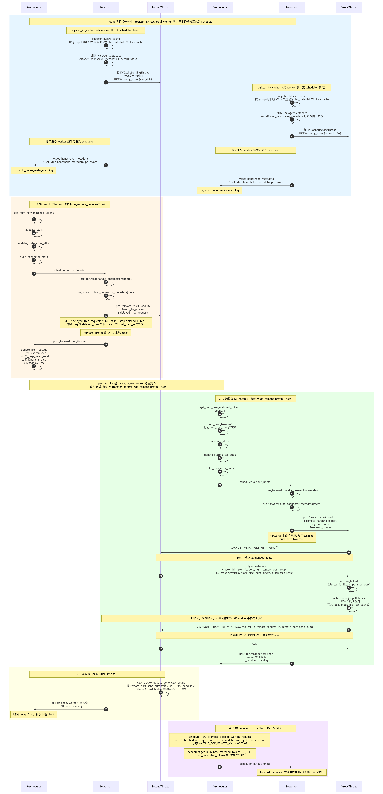

# RFC: vLLM-ascend HIXL Connector — KV Cache P2P 传输直连需求


## 1. 需求背景

**现状**：vLLM-ascend 有三种 P2P connector（MooncakeConnectorV1 / Hybrid / Layerwise），均基于 mooncake TransferEngine，其中 `MooncakeConnectorV1` 能力最全、是主用实现。在 P/D 分离场景下，P 节点算好的 KV Cache 要搬到 D 节点避免重算，由 connector 在 scheduler↔worker 之间协调完成搬运。

mooncake 的 ascend 后端底层是 HIXL（CANN 单边通信库），在其上叠加了 store/master/lease 等中间层。对 P/D 直传而言，这些中间层并不带来价值，只徒增开销。且MooncakeConnectorV1 的数据面采用**字节寻址**——按字节段注册内存、按裸字节地址读写，而 vLLM 的 KV cache 是 **block 粒度**的 paged tensor。两者模型不一致，需由 connector 在上层做 block 与字节地址之间的换算：既要维护一套 block 到字节地址的映射关系，传输时还要逐 block 推算出裸地址；TP>1 时也需用字节偏移把多个 rank 的数据拼进同一 block 的不同位置，传输完再做重排。

**方案：基于上述分析，考虑用 HIXL 直连替换数据面**。既然 mooncake 底层已是 HIXL，不如绕过其字节寻址数据面，直接对接 HIXL 的 LLM-DataDist 能力，新建一个 HIXL connector 承担 P/D 间的 KV 传输。新 connector 与 mooncake 并存，可配置切换、渐进迁移。具有以下核心优势：

- **原生 block 寻址**：HIXL 直接按 tensor/block 注册、按 block id 拉取，与 vLLM paged KV 的 block 粒度天然契合，可省去MooncakeConnectorV1中的block↔字节的地址换算。
- **去掉中间层**：省掉 mooncake 的 store/master/lease，P/D 直传更直接。
- **语义对齐降低耦合**：寻址、block 划分与传输语义统一在 block 层面，不再因引擎"不懂 block"而做上层裸地址补偿。

## 2. mooncake 现状

`MooncakeConnectorV1` 是 vLLM-ascend 三种 P2P connector 中能力最全的实现，也是 HIXL 方案的对标基准。其本质为**基于字节寻址的 RDMA 传输中间件**：底层仅以连续字节段为单位注册与读写内存，不感知 vLLM 的 block 粒度、层结构与 TP 划分；而 vLLM 的 KV cache 为 block 粒度的 paged tensor。二者寻址模型不一致，connector 需在二者之间维护一层 **block↔字节地址翻译适配**——该适配层即为本方案拟消除的全部成本。

按职责边界，该 connector 的完整实现可划分为三个层次：**控制面**（见 §2.1，与传输引擎无关，可复用）、**数据面**（见 §2.2，与传输引擎强耦合，其中地址翻译部分待删除）、**覆盖能力清单**（见 §2.3，按寻址方式二分）。

### 2.1 控制面（与传输引擎无关，可复用）

下列逻辑均属控制面，不触及字节寻址，更换传输引擎为HIXL时基本可逐字复用，具体控制逻辑可参考§3.2节：

- **ZMQ 控制面**：P 端以 ROUTER 模式监听握手端口，D 端以 REQ 模式经 socket 池复用建立连接，承担 P/D 间控制信令交换。
- **两类控制消息**：其一为元数据查询，D 向 P 查询对端 KV 寻址信息，作为后续拉取的前置；其二为拉取完成通知，D 拉取完成后告知 P，P 据此触发对应 block 的延迟释放。
- **scheduler 决策逻辑**：遵循 vLLM `KVConnectorBase_V1` 调度逻辑，覆盖新增匹配 token 数计算、分配后状态更新、connector 元数据构建、请求完成回调四个流程。
- **block 偏移计算**：建立 KV group 到层的映射，并计算每个 rank 需拉取的 block 范围，涵盖 TP/PP/PCP/DCP 多维划分。
- **端口分配**：以基础端口为基，按 dp×tp×pp×pcp 与 device index 偏移得到各 rank 握手端口，避免多 rank 端口冲突。
- **延迟释放与超时强释**：P 侧任务跟踪器在请求完成后延迟释放 block，待收到对应拉取完成通知才真正释放，超时则强制释放以回收资源。

### 2.2 数据面（与传输引擎强耦合）

其中 block↔字节地址换算逻辑由字节寻址方式决定，为本方案拟整体移除的部分：

- **内存注册**：按字节段注册 KV cache 内存；底层 HCCL 每进程 RDMA region 数上限为 256，需合并相邻内存段以规避配额限制——该合并可成立的前提正是字节寻址（单个大段内可容纳任意多个逻辑 tensor 地址）。
- **地址计算**：维护每层 block 的起始地址、长度与步长，按 block id 与偏移逐块推算出传输所需的裸字节地址。
- **数据拼接**：TP>1 时以字节偏移将多个 P rank 的 shard 写入 D 同一 block 的不同 split 位置，传输完成后做后置转置重排。
- **对端路由**：以 P 的主机地址与传输端口构造会话标识，D 据此标识读取对应 P，P 无需预先建立链路。

数据面采用 **P 被动暴露 + D-pull** 模型：P 仅完成传输引擎初始化、内存注册、暴露传输端口并启动控制面监听，不主动发送 KV；数据由 D 侧主动拉取。与传输引擎的实际交互仅初始化、内存注册、端口暴露、批量读写四类操作。

### 2.3 覆盖能力清单

mooncake 的覆盖能力清单如下，按寻址方式二分：

**寻址无关**（可逐字复用，详见 §5）：

- SWA 滑窗裁剪
- sparse attention
- SFA DCP replicate-K
- CP+MLA 联合 kernel 的映射逻辑

**寻址相关**（依赖字节寻址语义，HIXL block 寻址下须按 block 语义重新设计，详见 §5）：

- MLA/compress 的 kernel 展开
- Mamba state 的 conv_padding 基址偏移
- NZ layout 的 reformat
- `r_blk>1` 的 kernel_size 整除

## 3. HIXL Connector 实现方案

### 3.1 HIXL Connector 方案流程图



### 3.2 核心需求
1. **block 索引寻址替代字节寻址**：D 按 block id 主动拉取，不再维护裸字节地址与 block↔字节换算映射，从源头消除 §2.2 的地址翻译成本。
2. **保留 mooncake 控制面**：ZMQ 握手、scheduler 决策、block 范围计算、端口分配、延迟释放全部沿用；数据面载荷由"字节地址 + 会话标识"替换为"集群标识 + 监听端口"，控制面与数据面解耦后可独立演进。
3. **显式建链替代隐式会话路由**：D 单边向 P 建立链路，P 全程被动，以显式链路状态替代字符串会话标识的隐式路由。
4. **保留 D-pull 模型**：P 仅暴露可远程访问的 block 缓存供 D 主动拉取，传输发起方与数据流向不变。
5. **与 mooncake 同 P/D 并行配置下逐位对齐 KV**（验收基线）。

### 3.3 TP>1 的能力缺口（block 寻址固有限制）
block 寻址接口只能整块写入、无法写入 block 内部的 split 位置，mooncake 的字节偏移直写 split 方案不可复用。HIXL 须改用暂存缓存加后置重排予以补偿。这是寻址方式改变带来的核心架构差异。

### 3.4 覆盖能力对齐
须覆盖 §2.3 全部能力，每个能力与 mooncake 同配置逐位对齐；block 寻址下的迁移适配关注点见 §5。

### 3.5 与 mooncake 并存
作为独立 connector（`kv_connector=hixl`）与 mooncake 并存，可配置切换，不破坏现有 mooncake 用户。


## 4. 配置

HIXL connector 的配置类为 `HIXLConnector`，通过 vLLM 的 `kv_connector_extra_config` 启用。`extra_config` 下分三段：`hixl` 段配置 HIXL 传输层，`prefill`/`decode` 段分别配置 P/D 两侧的并行规模。`hixl` 段整体作为 `extra_options` 透传给 LLM-DataDist。

```jsonc
{
  "kv_connector": "HIXLConnectorV1",
  "kv_role": "kv_producer",          // P 为 kv_producer，D 为 kv_consumer
  "kv_port": 8000,                   // 握手端口基址
  "kv_connector_extra_config": {
    "hixl": {
      "cluster_id_base": 1000,        // 必填，P/D 两侧基址不相交
      "listen_port_base": 8000,      // 默认 kv_port + 1000
      "model_id": 0,                 // 模型标识起始值，默认 0
      "link_timeout_ms": 5000        // 建链超时，默认 5000ms
    },
    "prefill": {
      "dp_size": 1,
      "tp_size": 2
    },
    "decode": {
      "dp_size": 1,
      "tp_size": 2
    }
  }
}
```

字段说明：

- **kv_connector**：指定 connector 的注册名，填 `HIXLConnectorV1`。
- **kv_role**：节点角色，P 侧为 `kv_producer`（生产 KV），D 侧为 `kv_consumer`（消费 KV）。
- **kv_port**：握手端口基址，ZMQ 控制面端口与 `listen_port_base` 默认值均由此派生。
- **cluster_id_base**：必填，P/D 两侧基址不相交；实际 cluster_id = base + dp×(tp×pp×pcp) + device_index，保证每 rank 唯一。
- **listen_port_base**：监听端口基址，默认 `kv_port + 1000`，按与 cluster_id 相同的偏移公式分配。
- **model_id**：模型标识起始值，默认 0；多组缓存时 connector 按组自动递增分配，P/D 两侧按相同顺序读取，保证每组 `BlocksCacheKey` 唯一（见 §6 项 4）。
- **link_timeout_ms**：D 向 P 建立链路的超时阈值，默认 5000ms。
- **prefill.tp_size / decode.tp_size**：P/D 两侧 TP 规模。
- **prefill.dp_size / decode.dp_size**：P/D 两侧数据并行规模。

## 5. 迁移适配要点（block 寻址下的关注点）

§2.3 列出的能力，mooncake 已具备，HIXL 迁移到 block 寻址时各自需关注以下适配点。这些是**需求侧须覆盖的能力**，而非实现进度（实现进度见实现类文档）。

| 能力 | mooncake 做法 | HIXL 迁移关注点 |
|---|---|---|
| MLA/compress | 多 logical block 压进一个 tensor block，按 kernel block（block_size/scale）寻址，logical block 按 scale 倍展开 | block 寻址天然按 kernel id 寻址，需保证 logical→kernel 展开与拉取接口的 block id 口径一致；compress + D 端 prefix cache 时起点粒度可能错位（见 §6 项 1） |
| Mamba state（conv_padding） | 以基址前移 conv_padding 字节的方式，把 conv state 纳入注册区一并传输 | block 寻址无裸字节基址，无法做基址偏移；conv/ssm state 须作为额外 tensor 注册进 group cache，形状异质时拆独立 cache |
| NZ layout | 拉完后 NZ scatter 写 D cache | block 寻址下 pull 落 D cache（或 staging）后仍需等价 NZ reformat；MLA 单 head 场景 TP=1 直接落 D cache |
| SWA 滑窗裁剪 | 裁窗口尾部 block、丢占位 block | 寻址无关，裁剪逻辑可直接复用 |
| sparse attention | 稀疏注意力开启时退化为单 head group | 寻址无关，rank 选择逻辑复用 |
| SFA DCP replicate-K | 按 global block 重建 K 副本 | 寻址无关，block id 映射复用 |
| r_blk>1（P/D block_size 不等） | kernel_size 整除 Bp 使展开成立 | 需 scale>1 才能让 kernel_size 整除 Bp；无 MLA（scale==1）下不可达，是 block 寻址固有限制 |
| CP + MLA 联合 kernel | shard → kernel block 映射 | 需等价的 shard 映射；CP + D 端 prefix cache 时切片起点须用 external-only 偏移而非全局 block id |

> 总原则：寻址无关能力（SWA/sparse/SFA/CP 映射）逐字复用；寻址相关能力（MLA 展开、Mamba conv_padding、NZ reformat、TP>1 split）须按 block 语义重新设计。


---

